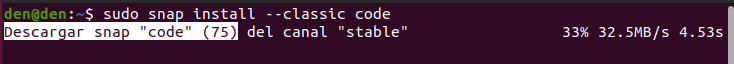
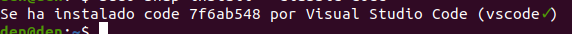
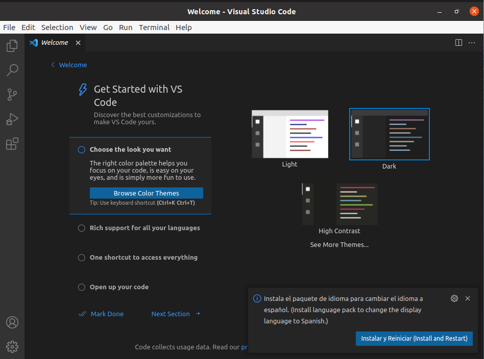
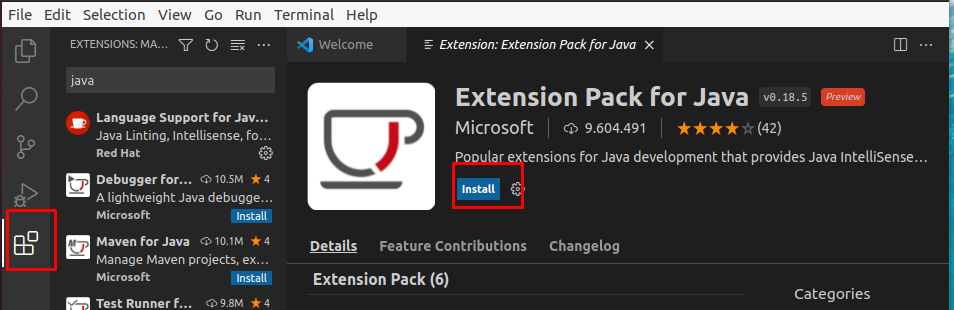
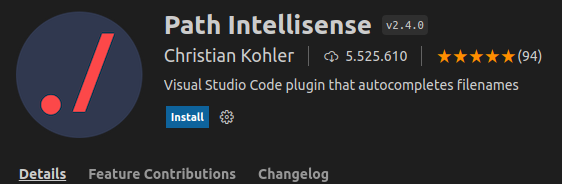
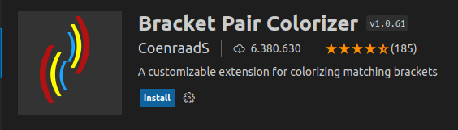
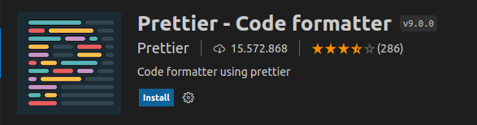
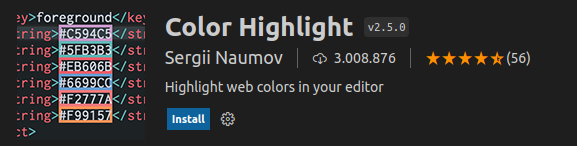
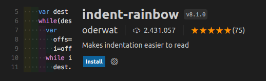

# Instalación de Visual Studio Code en Ubuntu 20.04
**Índice**

1. [Introducción](#1)
2. [Instalación de Visual Studio Code](#2)
3. [Configuración de las variables de entorno](#3)
4. [Instalación de plugins necesarios](#4)

## Introducción<a name="1"></a>
Visual Studio Code es un editor de código fuente, como lo es similar IntelliJ, Ant, NetBeans, entre otros IDE’s existentes. Es desarrollado por Microsoft para Windows, MacOS, y Linux.
## Instalación de Visual Studio Code<a name="2"></a>
Utilizaremos el siguiente comando para realizar la instalación:

```
sudo snap install --classic code
```
<div align="center">
 

 
</div>

Iniciará el proceso de descarga e instalación y una vez terminado nos aparecerá un mensaje avisándonos que se encuentra instalado el VS Code.

<div align="center">
 

 
</div>

## Ejecutar Visual Studio Code<a name="3"></a>
Buscaremos en nuestro cajón de aplicaciones de Linux un icono de la siguiente manera:

<div align="center">
 

 
</div>

Al ejecutarlo tardará un poco y nos aparecerá la primera página de la interfaz de VS Code.

<div align="center">
 

 
</div>

## Instalación de plugins necesarios<a name="4"></a>
VS Code cuenta con una gran variedad de plugins que podemos utilizar, pero hay algunos que debemos de tener casi obligatoriamente instalados antes de comenzar a trabajar.

Se podrán instalar y buscar dichos plugins desde el panel izquierdo, el último icono que parecen cuadrados juntos.

Estos plugins son los siguientes:

- Java Extension Pack

<div align="center">
 

 
</div>

- Visual Studio IntelliCode

Este plugin viene automáticamente instalado por el programa, por lo que no habría que hacer nada.

- Path Intellisense

<div align="center">
 

 
</div>

- Bracket Pair Colorizer

<div align="center">
 

 
</div>

- GitLens

<div align="center">
 

 
</div>

- Prettier

<div align="center">
 

 
</div>

- Color Highlight

<div align="center">
 

 
</div>

- Indent Rainbow

<div align="center">
 

 
</div>
